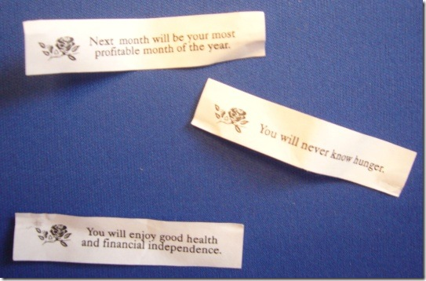

… but not in the way you might think. 
 
Our geek lunches and impromptu geek meetings usually end up happening at the Oriental Express (a.k.a Jimmy’s) here in Boise.
 
Check out the fortunes that 3 (out of 4) eaters at our table received last week:
 
 
 
The 4th guy (I’ll assume it was Chris Frye) got a fortune about love or romance or something. So last year!
