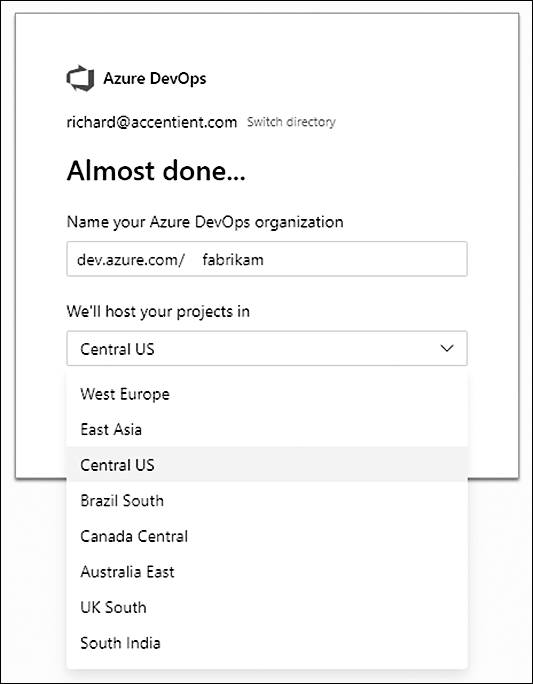
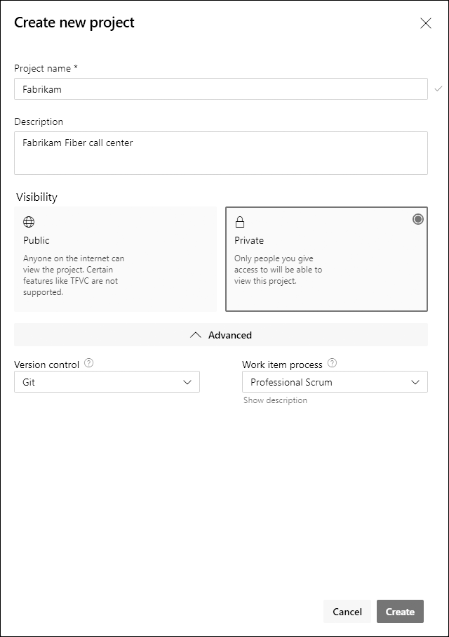

In rugby, a lot happens before kickoff. Fields get selected, dates get negotiated, teams get formed, and player positions get designated. Scrum development efforts have a pre-game too. It's everything from establishing the vision to provisioning the environment to organizing the team, and it runs right up to the start of the first Sprint. A few of those setup decisions are painful to reverse, so I treat them as a short checklist worth getting right.

<strong>Create the organization in the right region</strong>

An Azure DevOps organization is a mechanism for connecting groups of related projects. Your business structure should guide how many you create. When you create one, you also choose the Azure region where it will be hosted. Pick it deliberately, because Azure DevOps keeps your data, including work items, source code, and test results, within that region. Choose based on locality, network latency, or any data sovereignty requirements you have.

<figure class="wp-block-image size-large has-custom-border"></figure>

The organization name becomes part of the URL everyone uses, in the format https://dev.azure.com/{organization}. The trick, like with web domains, is finding something short that isn't taken. You can rename it later, but do yourself a favor and get it close now.

<strong>Provide access</strong>

Once the organization exists, add your team members and stakeholders as users, specify their credentials, and select their license type. Five users get Basic features for free, an unlimited number of Visual Studio subscribers get Basic features, and an unlimited number of stakeholders get free Stakeholder access. Anyone outside those buckets needs a purchased Basic or Basic + Test Plans license, which means setting up billing through an Azure subscription first. Although you can add users at the organization level, it makes more sense to do it once a project exists so you can assign a project role in the same step.

<strong>Create the project with the right process</strong>

The project is the container for the product's entire development lifecycle: the Product Backlog, the Sprint Backlog, the source code, and the tests. You create it on the Projects page of Organization settings, where you provide a name and select visibility, version control, and process. The process is the decision that's hard to undo, so if you practice <a href="https://scrumguides.org/" target="_blank" rel="noopener">Scrum</a>, choose a Scrum process here.

<figure class="wp-block-image size-large has-custom-border"></figure>

Keep the name short and tied to the product. It does not need the version, release, Sprint, team, or component baked in. All of that gets tracked inside the project using areas, iterations, teams, and repositories. Name it Fabrikam, not FabrikamSprint1Dev.

<strong>Add members</strong>

When the project is created, a default team is created with the same name. Add the Product Owner, Scrum Master, and Developers to it. I'm a fan of making every team member a Project Administrator and a Team Administrator so nobody gets blocked by the tool. The Scrum Team should focus on building great product, not waiting on permissions.

Get these few decisions right and the rest of the pre-game gets a lot easier. Sounds like good Scrum to me.

