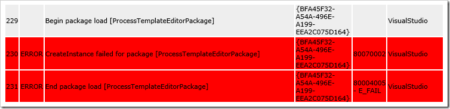
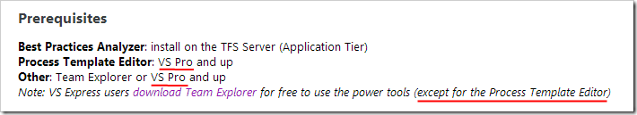

---
title: "The ProcessTemplateEditorPackage package did not load correctly"
date: 2014-02-26T08:55:24Z
author: "Richard Hundhausen"
slug: "the-processtemplateeditorpackage-package-did-not-load-correctly"
draft: false
tags: ["TFS", "Visual Studio"]
---

---

Yesterday, while using <a href="http://www.microsoft.com/en-us/download/details.aspx?id=40776" target="_blank" rel="noopener">Team Explorer for Visual Studio 2013</a> to customize a process template, I ran into this error …
 

 
As suggested, I checked the ActivityLog.xml, but it didn’t offer anything more than just the message <em>CreateInstance failed for package </em> …
 

 
A quick search found only a few posts, with <a href="http://social.msdn.microsoft.com/Forums/en-US/334d5ea7-38e2-40d9-b4ef-9fcdfbe24178/the-processtemplateeditorpackage-package-did-not-load-correctly" target="_blank" rel="noopener">this one</a> being the most relevant. Unfortunately the thread goes dark without a resolution. Remembering that I had to deal with a <a href="http://social.msdn.microsoft.com/Forums/en-US/ab90beb0-a8eb-437a-904d-620e31f4263d/adding-a-new-work-item-using-power-tools-2012?forum=tfspowertools" target="_blank" rel="noopener">similar impediment</a> with Team Explorer 2012, I re-read the <a href="http://visualstudiogallery.msdn.microsoft.com/f017b10c-02b4-4d6d-9845-58a06545627f" target="_blank" rel="noopener">Visual Studio Team Foundation Server 2013 Power Tools</a> requirements
 

 
It seems that in the 2013 version of the Power Tools Visual Studio Professional is a requirement for the Process Template Editor to work, whereas with 2012 it was only required for the graphical workflow designer.
 
<u>Summary</u>: Install Visual Studio Professional if you want to use any of the VS-integrated TFS 2013 power tools.

