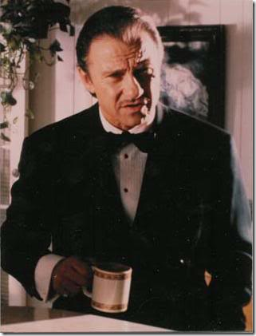

According to the <a href="http://www.scrum.org/scrumguides" target="_blank" rel="noopener">Scrum Guide</a>, a Scrum Team consists of the ScrumMaster, the Product Owner, and the Team. This works great, until issues, impediments, and dysfunctions are identified and its time to do some serious housecleaning (read: fire or repurpose team members). Since this is dirty work nobody likes to do, I propose a new, fourth role be added to the Scrum Team for just such situations: The <a href="http://en.wikipedia.org/wiki/Cleaner_(crime)" target="_blank" rel="noopener">Cleaner</a>.
 
So if you are the schlubbish team member who holds the team record for number of impediments (caused), then beware when this guy comes to your cubicle:
 
&nbsp; <a href="http://en.wikipedia.org/wiki/Harvey_Keitel" target="_blank" rel="noopener">Harvey Keitel</a> as "The Wolf" in <a href="http://en.wikipedia.org/wiki/Pulp_fiction_film" target="_blank" rel="noopener">Pulp Fiction</a>
