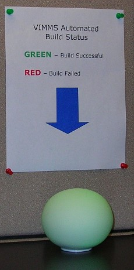

I was&nbsp;recently at a client site in Phoenix, teaching a VSTS/SCM course.&nbsp;They have integrated an <a href="http://www.thinkgeek.com/gadgets/electronic/5da2/" target="none" rel="noopener">Ambient Orb Device</a>&nbsp;into their automated build process. If the build passes, it glows green. If it breaks,&nbsp;it glows red.

The orb&nbsp;is inside the developer manager's office, so the devs can peek inside. My understanding is that they have about 15 minutes after seeing red to fix the build and re-run it, before the manager gets an email message.
