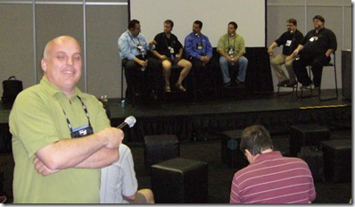
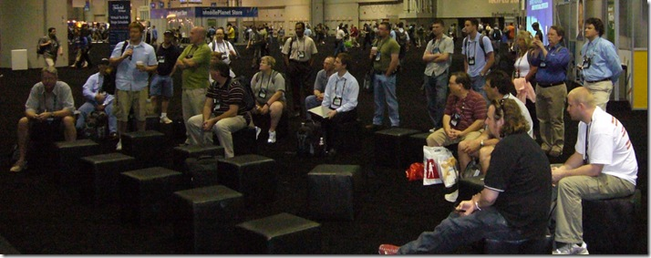

Man, I need to keep a closer eye on the work product over at <a href="http://www.dotnetrocks.com" target="_blank" rel="noopener">.NET Rocks</a>. I had meant to link up this <a href="http://perseus.franklins.net/dotnetrocks_0250_vsts_panel.pdf" target="_blank" rel="noopener">transcript</a> last Summer, but I dropped the ball. Apologies.
 
So, what this was was a VSTS panel discussion at Tech-Ed in Orlando last June, with Mike Azocar, Steven Borg, Doug Seven, Joel Semeniuk, and the hosts Richard Campbell and Carl Franklin.
 
Here's the panel (with <a href="http://objectsharp.com/cs/blogs/barry/default.aspx" target="_blank" rel="noopener">Barry Gervin</a> running the microphone)  
 
And some of the audience (you can see <a href="http://blogs.msdn.com/robcaron/" target="_blank" rel="noopener">Rob Caron</a> and <a href="http://teamsystemrocks.com/blogs/mickey_gousset/default.aspx" target="_blank" rel="noopener">Mickey Gousset</a> in the back).  
 
There's some pretty good questions in there, especially those asked by yours truly!
