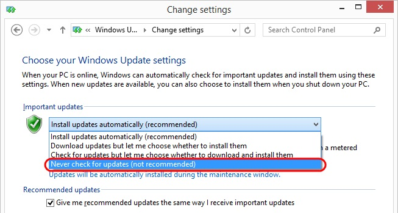
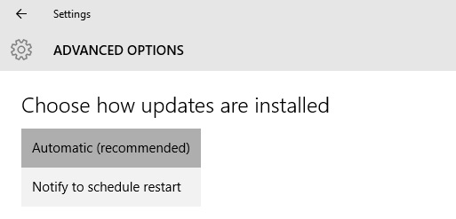
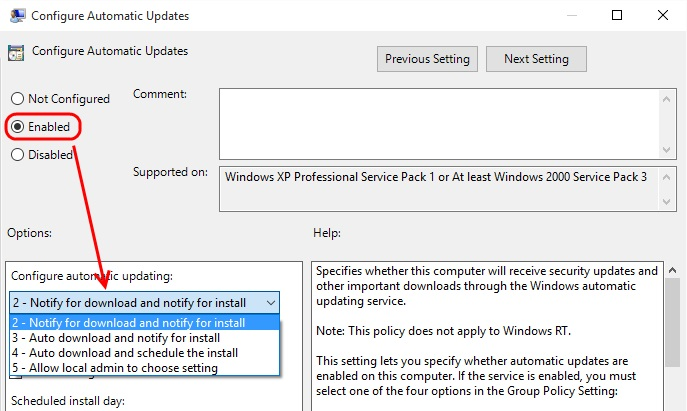
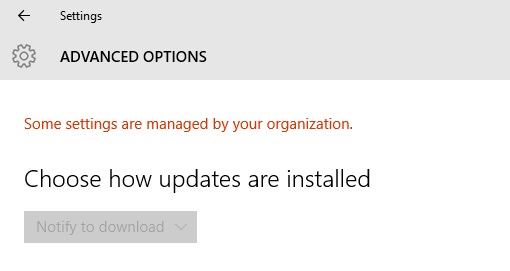

---
title: "Turn off Automatic Updates on Windows 10 Professional"
date: 2015-08-03T14:14:32Z
author: "Richard Hundhausen"
slug: "turn-off-automatic-updates-on-windows-10-professional"
draft: false
tags: ["Windows"]
---

---

Call me weird, but when I create and maintain virtual machines for demonstration and training, I like to be in control of if/when Windows updates are installed. This is fit for purpose since I'm not using these VMs for production. In Windows 8.1 it was a straightforward setting ...

Windows 10 Professional is not so straightforward. Going into the Advanced Options page didn't give me much in the way of options ...

After some enlightenment from comments in <a href="https://4sysops.com/archives/turn-off-automatic-updates-in-windows-10-build-9926/" target="_blank" rel="noopener">this post</a>, I was able to get the behavior I wanted by setting a local policy ...
<ol>
	<li>Run <strong>gpedit.msc</strong>.</li>
	<li>Expand <strong>Computer Configuration</strong> &gt; <strong>Administrative Templates</strong> &gt; <strong>Windows Components</strong> &gt; <strong>Windows Update</strong>.</li>
	<li>Double-click the <strong>Configure Automatic Updates</strong> setting.</li>
	<li>Change the setting to <strong>Enabled</strong> and select option <strong>2 - Notify for download and notify for install.</strong></li>
</ol>
 

<ol start="5">
	<li>Save your changes, exit the Group Policy editor, and restart Windows (or run <a href="https://technet.microsoft.com/en-us/library/Bb490983.aspx" target="_blank" rel="noopener">GPUpdate.exe</a>).</li>
</ol>
The Windows Update Advanced Options page now shows me what I want and, more importantly, Windows 10 behaves the way I want.

Note: Needless to say, to change the behavior back, or to a different setting, you'll need to redo the above steps.

&nbsp;

&nbsp;
