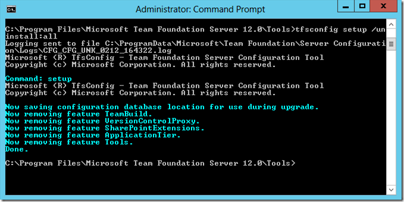

---
title: "Unconfiguring Team Foundation Server 2013"
date: 2014-02-13T12:32:12Z
authors: ["Richard Hundhausen"]
slug: "unconfiguring-team-foundation-server-2013"
draft: false
tags: ["TFS"]
---

---

This is an update to an <a href="https://accentient.com/blog/unconfiguring-team-foundation-server-2010/" target="_blank" rel="noopener">older post</a> that I had written for TFS 2010. Here are the steps to unconfigure TFS 2013 …

1. Execute <a href="http://msdn.microsoft.com/en-us/library/ms253116.aspx">tfsconfig setup /uninstall:all</a>.

This should be done from the %ProgramFiles%Microsoft Team Foundation Server 12.0Tools directory.

2. Drop the Tfs_Configuration, Tfs_Warehouse, and (optionally) any team project collection relational databases.

3. Drop the Tfs_Analysis Analysis Services database.

4. Optionally, delete any <a href="http://msdn.microsoft.com/en-us/library/ms253177.aspx">SharePoint site collections</a> that were created.

5. Optionally, delete any <a href="http://msdn.microsoft.com/en-us/library/ms186470.aspx">SQL Reporting Services folders</a> that were created.

I’m still not convinced that “unconfigured” is a word, even though I found it defined <a href="http://en.wiktionary.org/wiki/unconfigure" target="_blank" rel="noopener">online</a>.
