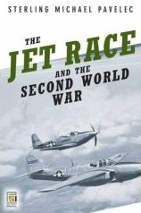

My good friend, <a href="http://www.historymike.com/" target="none" rel="noopener">Dr. Michael Pavelec</a>, history professor at <a href="http://www.hpu.edu" target="none" rel="noopener">Hawaii Pacific University</a> has written another book on WWII military aviation ...
<table border=1><tr><td></td></tr></table>

"In the 1930s, as nations braced for war, the German military build up caught Britain and the United States off-guard, particularly in aviation technology. The unending quest for speed resulted in the need for radical alternatives to piston engines. In Germany, Dr. Hans von Ohain was the first to complete a flight-worthy turbojet engine for aircraft. It was installed in a Heinkel designed aircraft, and the Germans began the jet age on August 27, 1939. The Germans led the jet race throughout the war and were the first to produce jet aircraft for combat operations. In England, the doggedly determined Frank Whittle also developed a turbojet engine, but without the support enjoyed by his German counterpart. The British came second in the jet race when Whittle's engine powered the Gloster Pioneer on May 15, 1941. The Whittle-Gloster relationship continued and produced the only Allied combat jet aircraft during the war, the Meteor, which was relegated to Home Defense in Britain. &nbsp; In America, General Electric copied the Whittle designs, and Bell Aircraft contracted to build the first American jet plane. On October 1, 1942, a lackluster performance from the Bell Airacomet, ushered in the American jet age. The Yanks forged ahead, and had numerous engine and airframe programs in development by the end of the war. But, the Germans did it right and did it first, while the Allies lagged throughout the war, only rising to technological prominence on the ashes of the German defeat. Pavelec's analysis of the jet race uncovers all the excitement in the high-stakes race to develop effective jet engines for warfare and transport."  You can pre-order&nbsp;the book&nbsp;at <a href="http://www.amazon.com/Jet-Race-Second-World-War/dp/0275993558" target="none" rel="noopener">Amazon.com</a>.
