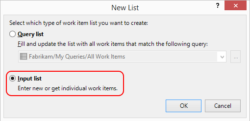
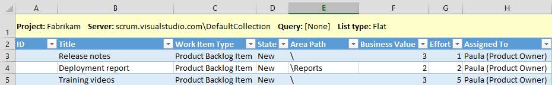
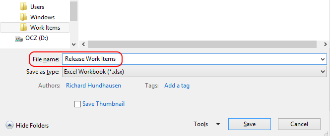
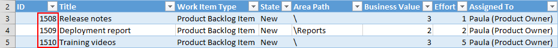

---
title: "Use Excel to Create Repetitive Work Items"
date: 2015-02-24T10:27:15Z
author: "Richard Hundhausen"
slug: "use-excel-to-create-repetitive-work-items"
draft: false
tags: ["TFS", "Visual Studio ALM"]
---

---

Teams often ask me for any shortcuts to periodically creating the same work items, such as for each sprint or release. In other words, they want to create the same Product Backlog Item or Task (but hopefully not Bugs) over and over.

My first suggestion is to use <a href="https://msdn.microsoft.com/en-us/library/ff407162.aspx" target="_blank" rel="noopener">work item templates</a> in TWA or TFPT to pre-populate fields. While helpful, this approach only helps with a <em>single</em> work item; but what about a series of work items? <a href="https://msdn.microsoft.com/en-us/library/dd286627.aspx" target="_blank" rel="noopener">Excel</a> is the answer (but you already knew that, didn't you).

Here are the high-level steps …
<ol style="margin-bottom: 5px;">
	<li>Start <strong>Excel</strong>.</li>
	<li>From the <strong>Team</strong> menu, select <strong>New List</strong>.</li>
	<li><a href="https://msdn.microsoft.com/en-us/library/ms181675.aspx" target="_blank" rel="noopener">Connect</a> to your <strong>Team Foundation Server</strong>, <strong>collection</strong>, and <strong>team project</strong>.</li>
	<li>Select <strong>Input List</strong>.</li>
</ol>

<ol style="margin-bottom: 5px;" start="5">
	<li>Enter the work items to be created (Title, Work Item Type, Assigned To, etc.). Add additional fields as necessary.</li>
</ol>

<ol style="margin-bottom: 5px;" start="6">
	<li><strong>Save</strong> the spreadsheet using a meaningful file name (that you'll recognize later).</li>
</ol>

<ol style="margin-bottom: 5px;" start="7">
	<li>Click <strong>Publish</strong> to create those work items (at which point the work item IDs will be populated).</li>
</ol>

<ol style="margin-bottom: 5px;" start="8">
	<li><strong>Exit</strong> Excel without saving the changes.</li>
</ol>
<blockquote>If you do save your changes, then the spreadsheet becomes one that can only <em>update</em> those work items.</blockquote>
<ol start="9">
	<li>Later, open the spreadsheet, update any field values, click Publish, and exit without saving.</li>
</ol>
