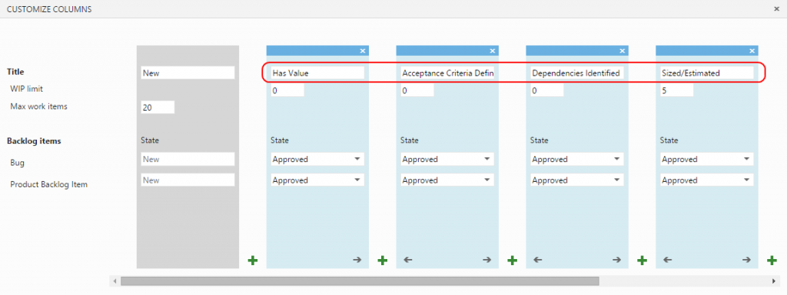
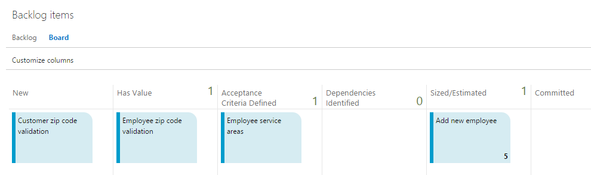

---
title: "Using the Kanban Board to Implement a Definition of Ready"
date: 2014-11-14T12:57:29Z
authors: ["Richard Hundhausen"]
slug: "using-the-kanban-board-to-implement-a-definition-of-ready"
draft: false
tags: ["Azure DevOps", "Scrum", "TFS"]
---

---

More and more teams are adopting a <a href="http://guide.agilealliance.org/guide/definition-of-ready.html" target="_blank" rel="noopener">Definition of Ready</a> (also known as DoR or Readiness Criteria) to avoid starting work on PBIs that are ill-defined, such as those that do not have clearly defined acceptance criteria. While some teams can do this implicitly, others want a formal definition to explicitly communicate this working agreement with their Product Owner and stakeholders. Some teams want to make this definition actionable, such as creating tasks to move a PBI through each Ready "gate".

Creating and associating (non development) tasks prior to the Sprint seems like a lot of overhead and has a smell of waste, but it did get me thinking. For teams using Visual Studio, they could leverage the <a href="http://msdn.microsoft.com/en-us/library/jj838789.aspx" target="_blank" rel="noopener">Backlog (Kanban) Board</a> to enact their definition of "Ready" by adding new columns under the <em>New</em> or <em>Approved</em> states. I like using the <em>Approved</em> state because to me that means that the Product Owner has acknowledged the PBI as being something valuable. PBIs in the <em>New</em> state have yet to capture the Product Owner's interest.

Assuming a simple Definition of Ready (based loosely on <a href="http://en.wikipedia.org/wiki/INVEST_(mnemonic)" target="_blank" rel="noopener">INVEST</a>):

<ul>
<li>Has value</li>
<li>Acceptance Criteria defined</li>
<li>Dependencies identified</li>
<li>Sized/Estimated</li>
</ul>

You can customize your Kanban board appropriately:

Notice that I changed the original "Approved" column to "Has Value" and then added 3 additional ones. All 4 columns still map to the Approved state of the PBI, so the underlying work item type doesn't need to change - which is the beauty of this approach. I also removed the WIP limits for these columns by setting the values 0. Feel free to use WIP limits, if that makes sense for your team.

Here's an example of the customized Kanban board:

Happy Ready'ing.

