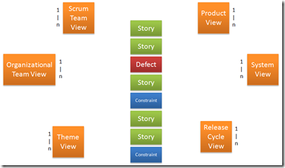

In many Agile development processes, there exists the idea of THE BACKLOG. This is particularly true in Scrum, the methodology that originated the idea. The recipe from Scrum is a Product Backlog which contains all the requirements or features desired in the software being created. 
 
The backlog items are organized in priority order, determined by the Product Owner (PO). The PO can use any criteria to prioritize the backlog items. Priorities may be driven by risk, return on investment, or client demand. No matter what technique is used, this prioritization is crucial to the use and effectiveness of the backlog. 
 
This all works quite well in a&nbsp; situation of a single team creating a single product. It even works well when we scale up a bit and have one team working on several products. It just becomes necessary for the two product owners to strike a bargain on how to share team capacity.
 
It turns out that scaling to even bigger scenarios with an Enterprise Backlog and many teams working from it presents some new challenges. In this model you manage all work in the enterprise in a single backlog. This immediately draws into question what the "real" backlog is. Backlog managers may be interested in a view of the backlog that shows the prioritized list of items for a particular system, a team, a product, a release, or some other grouping.It becomes quickly apparent there are many ways to "see" the backlog.
 
 
 <h2>Which Backlog View Wins?</h2> 
Obviously, a PO is primarily interested in the view that shows the backlog for a particular product. For a release manager, coordinating the overall release of a product suite, the view of items to be included across many products in a big release is the perfect view. If you are a project manager, interested in a theme of work that will affect many products (think the Smart Art feature in Office 2007), you are looking for the theme view. We can think of this problem as dimensions in a multidimensional cube if it helps you BI types.
 
With all these views of the backlog going on, and each one of theme prioritized from 1-n, which one is the actual backlog? 
 <ul> <li>Theme View  <li>System View  <li>Release Cycle View  <li>Scrum Team View  <li>Product View </li></ul> 
The easy answer is, "They are all important, depending on who you are and what you are interested in." It is true, though, that two of these view are closer to reality than all the others. While most of these views represent what we hope will get done, 2 of them are just a bit closer to what will get done, or has been done.
 <h3>The Scrum Team View</h3> 
This view aggregates the work items into a collection that actually represents what the team will be doing. This is the backlog the team will use in Sprint planning as they plan an iteration of work. If you are a theme owner and your work items aren't showing up in the Scrum Team View, you're in trouble.
 <h3>The Release Cycle View</h3> 
This view (and an associated burndown chart) helps us see the reality of features that are scheduled for release and those that have been completed. This view represents the absolute reality of what we can tell the clients will be in the next release.
 <h2>Just Get Them</h2> 
The real truth is that all of the views really are important. The real challenge is in deriving the views in the first place. If you are trying to work with an Enterprise Backlog and haven't got a good model for segmenting it, you may soon find it unwieldy. Find the right view to help you interact with the requirements and make sure your backlog items provide the data needed to see it. Just remember the 2 views that live closer to where the rubber meets the road.
