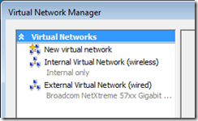
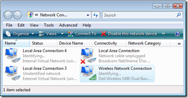
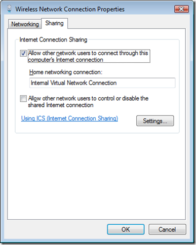
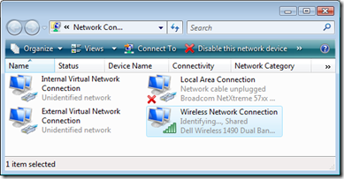

Getting a virtual machine connected to the outside world in Hyper-V is a non-intuitive process. I had to bumble around with it a bit before finding the secret combination that worked well. Before I show you how it’s done (or at least one way of doing it), here are a couple of things to keep in mind:

<ul>

 	<li>When you add the Hyper-V role to Windows Server 2008, Hyper-V more or less takes over the physical computer and Windows Server 2008 becomes a virtual machine running in a special space called the home partition.</li>

 	<li>Hyper-V uses the concept of virtual networks. It’s as if your computer magically ingested a Netgear network switch, you know, that little blue box with lots of blinking lights on one side and network cable plugs on the other, which you use to create a home computer network. That’s right, the brilliant folks at Microsoft figured out how to suck one of those network switched right into their server operating system (I’m not sure, but I think they’re using <a href="http://en.wikipedia.org/wiki/Willy_Wonka_and_the_Chocolate_Factory" target="_blank" rel="noopener noreferrer">Wonkavision</a> technology to do it). Not only is the network switch virtualized, but all the cables to connect to it are virtualized as well. Now that’s handy.</li>

 	<li>Hyper-V implements three types of virtual networks: external, private and internal. An external virtual network gives virtual machines direct access to a physical network adapters on the physical computer. In effect, the virtual network shares the physical network adapter with the parent operating system (the Windows Server 2008 originally installed on the computer). A private network is used to connect two or more virtual machines running on the same physical computer to one another. An internal network is just like a private network, except it includes the parent operating system as well.</li>

 	<li>A virtual machine connects to a virtual network through a Hyper-V network adapter. Yep, you guessed it – a Hyper-V network adapter is virtual as well. Each virtual network adapter can connect to only one virtual network. However, a virtual machine can have multiple virtual network adapters, with each adapter connected to a different virtual network.</li>

 	<li>You can create any number of virtual networks and virtual network adapters in Hyper-V, limited only by how much load the hardware can support.</li>

 	<li>You cannot create an external virtual network that connects to a wireless network adapter. Sorry, the folks who created Hyper-V simply decided not to go there. Fortunately there’s a simple workaround that I’ll show you in this post.</li>

</ul>

Let’s say you want to configure your virtual machine to automatically use the physical network adapter whenever it’s plugged into a live connection, and also use a wireless connection when the physical network adapter is not plugged in. Here’s how you do it:

<h3>Step 1. Setup your Virtual Networks</h3>

This procedure assumes that you are running Windows Server 2008 on a computer that supports <a href="http://www.pcmag.com/encyclopedia_term/0,2542,t=hardware+virtualization&amp;i=44120,00.asp" target="_blank" rel="noopener noreferrer">hardware virtualization</a>, and that you are logged into an account that is a member of the Administrators group.

<ul>

 	<li>Launch the Hyper-V Manager</li>

</ul>

Create an Internal virtual network

<ul>

 	<li>In the Actions menu, click on Virtual Network Manager</li>

 	<li>In the box labeled "What type of virtual network do you want to create?" select Internal. Click the Add button.</li>

 	<li>In the New Virtual Network dialog box, enter the following:

- Name: Internal Virtual Network (wireless)

- Connection type: Internal Only

Click OK</li>

</ul>

Create an External virtual network

<ul>

 	<li>Click on Virtual Network Manager</li>

 	<li>In the box labeled "What type of virtual network do you want to create?" select Internal. Click the Add button.</li>

 	<li>In the New Virtual Network dialog box, enter the following:

- Name: External Virtual Network (wired)

- Connection type: External

Select the network adapter you want to use in the drop-down list

Click OKThe Virtual Network Manager should look something like this:

</li>

</ul>

<h3>Step 2. Setup the Wireless Network Connection for Sharing</h3>

This step is the secret ingredient that allows a Hyper-V virtual machine to access a network connection through the physical computer's wireless adapter.

<ul>

 	<li>Switch over to the parent operating system; i.e., the Windows Server 2008 originally installed on the physical computer.</li>

 	<li>Launch the Network and Sharing Center</li>

 	<li>Click on Manage Network Connections

Note that there is a new network connection for each of the virtual networks you created in Step 3.</li>

 	<li>Right-click on the Local Area Connection that shows "Internal Virtual Network (wireless)" below its name. Select Rename. Give it the name "Internal Virtual Network Connection"</li>

 	<li>Right-click on the Local Area Connection that shows "External Virtual Network (wired)" below its name. Select Rename. Give it the name "External Virtual Network Connection"</li>

 	<li>Right-click on your Wireless Network Connection and select Properties</li>

 	<li>Click on the Sharing tab</li>

 	<li>Select the checkbox labeled "Allow other network users to connect through this computer’s Internet connection"

</li>

 	<li>Click OK

Your Network Connections list should now look something like this:</li>

</ul>

<h3>Step 3. Connect a Virtual Machine to the Virtual Networks</h3>

The procedure can only be performed on a virtual machine that is turned off. Do this for each virtual machine you want to connect to the external world.

<ul>

 	<li>Switch to the Hyper-V Manager</li>

 	<li>Select the virtual machine you want to configure.</li>

 	<li>Click on the Settings link</li>

 	<li>In the Hardware list, click on Network Adapter</li>

 	<li>In the Network Adapter properties pane, select Internal Virtual Network (wireless). Click the Apply button</li>

 	<li>In the Hardware list, click on Add New Hardware</li>

 	<li>In the Add Hardware properties pane, select Network Adapter, then click the Add button</li>

 	<li>Back in the Hardware List, click on the Network Adapter marked "Not Connected"</li>

 	<li>In the Network Adapter properties pane, select External Virtual Network (wired). Click the Apply button.

The Hardware list should now contain these two entries:</li>

 	<li>Click OK to complete the configuration.</li>

</ul>

<h4>Step 4. Give it a Whirl</h4>

<ul>

 	<li>Verify that the parent operating system has Internet connectivity</li>

 	<li>Start the virtual machine</li>

 	<li>In the virtual machine, log on, open a web browser and browse to your favorite web site.</li>

</ul>

Your virtual machine should now have total Internet connectivity!