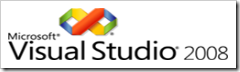

Nice work Microsoft. The <a href="http://msdn2.microsoft.com/en-us/vstudio/aa700831.aspx" target="_blank" rel="noopener">download page</a> just came online today. You can download Installation Disc Images, VPC Images, or Express Editions.

There's even a link to download the .NET Framework 3.5 Beta 2 at the bottom of the page.