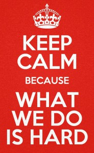

---
title: "Visual Studio Live! in Austin"
date: 2015-06-03T22:07:03Z
author: "Richard Hundhausen"
slug: "visual-studio-live-in-austin"
draft: false
tags: ["Conferences", "Scrum", "Visual Studio"]
---

---

Update: Added additional links for my same talks at VSLive! in San Francisco today (17 June, 2015)

Thank you to those who attended my two talks today. I enjoyed our conversation about Technical Debt and Professional Scrum Development.

Here are a few bookmarks that I mentioned during my talks ...

Technical Debt
<ul>
	<li><a href="http://kenpsycdoc.blogspot.com/2011/05/assertive-communication-honest.html" target="_blank" rel="noopener">HARD (Honest Appropriate Respectful Direct) communication</a></li>
	<li><a href="http://research.microsoft.com/en-us/projects/pex" target="_blank" rel="noopener">Microsoft Pex (Microsoft Research)</a></li>
	<li><a href="https://visualstudiogallery.msdn.microsoft.com/fb5badda-4ea3-4314-a723-a1975cbdabb4" target="_blank" rel="noopener">Microsoft Code Digger Extension (Visual Studio 2013)</a></li>
	<li><a href="https://msdn.microsoft.com/en-us/library/dn823749.aspx" target="_blank" rel="noopener">IntelliTest (Visual Studio 2015)</a></li>
</ul>
Professional Scrum Development
<ul>
	<li><a href="http://en.wikipedia.org/wiki/Shuhari" target="_blank" rel="noopener">Shuhari </a></li>
	<li><a href="https://accentient.com/blog/measuring-the-business-value-of-a-pbi/" target="_blank" rel="noopener">Measuring the Business Value of a PBI</a></li>
	<li><a href="https://accentient.com/blog/using-the-kanban-board-to-implement-a-definition-of-ready/" target="_blank" rel="noopener">Using the Kanban Board to implement a Definition of Ready</a></li>
	<li><a href="https://accentient.com/blog/use-excel-to-create-repetitive-work-items/" target="_blank" rel="noopener">Use Excel to create repetitive work items</a></li>
	<li><a href="http://1drv.ms/1QrnfdB" target="_blank" rel="noopener">Think about delivering value every Sprint</a></li>
	<li><a href="http://www.forbes.com/sites/travisbradberry/2014/10/08/multitasking-damages-your-brain-and-career-new-studies-suggest/" target="_blank" rel="noopener">Multitasking damages your brain and career (Forbes)</a></li>
</ul>
Also, here is my ScrumRobot source code which helps me quickly create areas, iterations, Product Backlogs, and Sprint Backlogs for demos and training. Put it to good use please.

Attachment: <a href="ScrumRobot.zip">ScrumRobot.zip</a>

