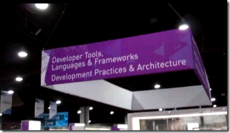

---
title: "Visual Studio Technical Learning Center at TechEd 2011"
date: 2011-05-24T23:09:39Z
authors: ["Richard Hundhausen"]
slug: "visual-studio-technical-learning-center-at-teched-2011"
draft: false
tags: ["Conferences", "Microsoft"]
---

---

I wanted to post a short video of the Technical Learning Center (TLC) at this year’s Tech-Ed conference in Atlanta, GA. The TLC is the place to see Microsoft product demos, talk with industry experts, learn about Microsoft services, and connect with your peers. In case you didn’t make it, the video below shows just how cool and organized the area was.
 

 
I can’t wait for <a href="http://northamerica.msteched.com" target="_blank" rel="noopener">Orlando</a> next year!

