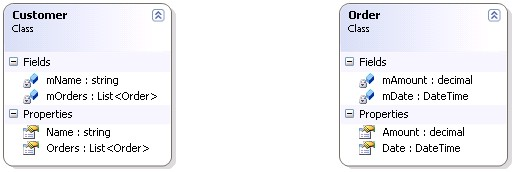
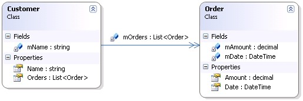

 Thanks to a student, Jim Munn, for originally asking the question "When adding a property to an object that uses System.Collections.Generic.List&lt;&gt; the designer doesn't show a relation to the class that the generic collection is typed to. Why not?"

So, let's assume you have two classes: <em>Customer</em> and <em>Order</em>

Notice how, by default, the association is not displayed between the Customer and Order class. By right-clicking either the <em>mOrders</em> field or <em>Orders</em> property and selecting <em>Show as Collection Association</em>, the association will be visualized:
