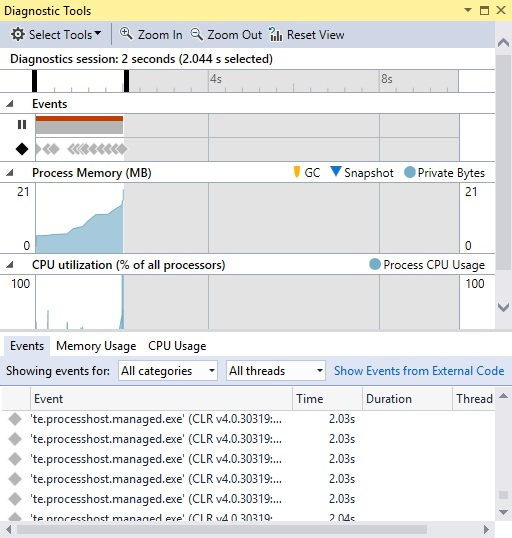
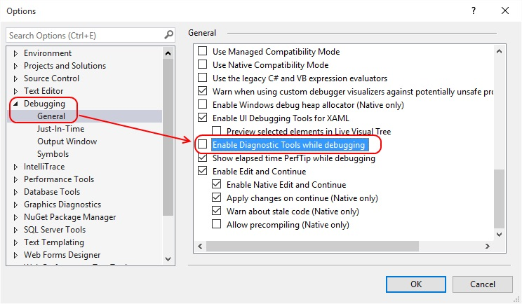
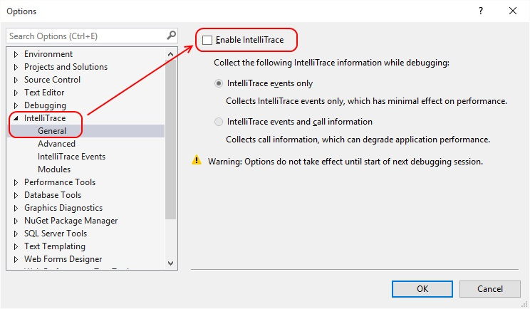

---
title: "Turn off the Diagnostics Tools window in Visual Studio 2015"
date: 2015-08-17T11:58:41Z
author: "Richard Hundhausen"
slug: "vs2015-diagnostics-tools-window"
draft: false
tags: ["Visual Studio"]
---

---

I'm sure it's awesome.
I'm sure it doesn't impact performance (much).
I'm sure my apps would be more awesome if I used it, but ...

... today I want to turn off this "helpful" window from always showing while I was debugging my code ...

So I followed these steps ...
<ol>
	<li>Tools &gt; Options &gt; Debugging.</li>
	<li>Clear the "Enable diagnostic tools while debugging" option.</li>
</ol>

Oh, and I took the opportunity to turn off IntelliTrace while I was in there too ...

#PerformanceEek
