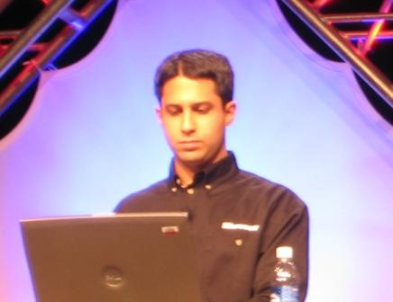

Ajay Sudan is presenting an overview of&nbsp;Team System&nbsp;at VSLive2005.&nbsp; He's giving an excellent overview of the entire topic.&nbsp; To be cleaned&nbsp;up later...

Cool Info:

<ul>
<li>Team foundation will support up to 500 developers out of the box.&nbsp; For more developers, TFS installs can be 'chained'.
<li>You can create a new project by BRANCHING from an existing project!!
<li>Can install your companies data center as a 'drag and drop' control from the toolbox.
<li>Code Coverage is easy!&nbsp; You can show how much of your code is covered by your unit tests with a few clicks!</li></ul>

 

&nbsp;

Demo: Adventure Works - Expose web services to the outside world.&nbsp; Will need to move to a three-tier architecture

<ul>
<li>Create a new project - Give it a name
<li>Pick a development process template - MSF 4.0 Agile or MSF 4.0 Complete
<li>This creates a group of tasks, and a structure with document templates needed to use MSF 4.0 Agile (or whatever you picked)
<li>Name the project portal - this will create a Sharepoint site
<li>He's opening up a new design surface using the Application Designer
<li>He simply drags two new web services to the diagram and connects them.&nbsp; This is the power of the designers!
<li>He'2013-08-28 13:52:38's viewing the "Settings and Constraints" that he wants for the Web Services.&nbsp; This is a cool feature that ties into the <a href="http://www.microsoft.com/windowsserversystem/dsi/default.mspx">Dynamic Systems Initiative (DSI).</a>
<li>Ajay stresses that he's just 'whiteboarding' right now.
<li>But here comes the "Generate" click, and BINGO! the application is designed.
<li>A quick switch to the Logical Datacenter Designer.&nbsp; This will allow an IT expert to define restrictions, etc of the IT architecture.&nbsp; Once again, this is a tie-in to the DSI (using the System Definition Model (SDM)).
<li>He's adding a new a new Distributed System Diagram to the project, and doing the drag drop.
<li>Using the AdventureWorks Center that the IT folks already installed in the toolbox.
<li>He's binding the services created in the Application Diagram object to the actual infrastructure of the AdventureWorks servers in the Logical Datacenter Diagram.&nbsp;
<li>We can now validate the diagram to ensure that all constraints are met, and that we can deploy the application.
<li>The validation failed, since AdWorks is using NT4 and the web services require Windows Server 2003.
<li>So, he simply adds a Work Item, telling the Infrastructure Architect to upgrade the server!&nbsp; ;-)
<li>Now, he's generating code.
<li>By right-clicking, he's able to generate a new unit test.&nbsp; (This kicks butt, and will be available in VS Professional, too)
<li>So, he can easily build unit tests against against the code.
<li>In addition, the can show the code coverage easily.
<li>Now, when he runs the application, the code coverage will run and he can see how much of his code is covered by the unit tests. (Green highlights are code that is covered, Red highlights show code that isn't covered).
<li>Now he does the Static Code Analysis - remember, it's extensible.
<li>Cool piece!&nbsp; He's setting up a rule that forces devs to run static code analysis, code coverage and unit tests BEFORE allowing them to check in code.
<li>Class Designer is next - he's stressing that the code and designer are different views of the same thing (there is no 'round tripping' going on here)
<li>Now he's built the code to make the Web service run. (The web service sends an instant message to his IM client.)
<li>Now it's time for integration with AdWorks.&nbsp; What happens is that when the customer checks out, they will be sent an IM thanking them for their purpose.&nbsp;
<li>What makes it easy is that the proxies are all created automatically when the architecture was designed. Next test will be a Web Test.&nbsp;
<li>This will record his click streams as he wanders through his application.
<li>Now, he's got his 'test', but he needs to extend it to order more than just one item.
<li>So he uses the UI to extend the test to order multiple different items.&nbsp; These items will come from a database, randomly.
<li>Now, using the web test, he's going to extend it by adding a Load Test
<li>Load Tests are a container for any types of test.&nbsp; Can run a constant stress, or ramp up over time.&nbsp; You can also specify which tests you want to run.&nbsp;
<li>with Load tests you can simluate think time, browser types, and network types.
<li>The load tests will collect lots of different performance counters.&nbsp; There are three groupings of perf counters to help you.
<li>Now, running the load test, and the data starts to plot out graphically.
<li>By opening up the IM client, we can see that the test is running, since he's getting lots of IM alerts.
<li>There are built in thresholds and reasonable numbers that you can use, just in case you're not an expert at interpreting performance counters.
<li>Back to VSTS.
<li>He's going to check in his code, and he's associating the code checked in with the work items he was assigned.
<li>He's mentioning shelving - a temporary branch that can be used to store code at the server without officially checking it in.
<li>Key point: VSTS tracks important data without the need to individually ask developers for input.&nbsp; Yea!</li></ul>

Great presentation and demo!&nbsp; Lot's of excitement in the crowd!!&nbsp; YES!!!&nbsp; VSTS ROCKS!

&nbsp;

 &nbsp;
