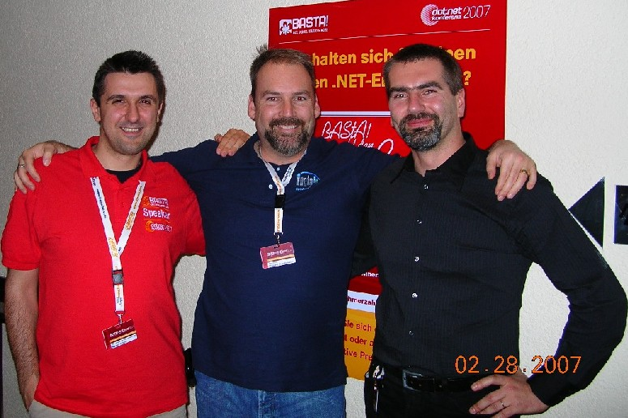

It took me a couple of days to go through my photos, but I found a good one of the various Visual Studio Team System MVPs who attended Basta!

Here's <a href="http://www.codeattest.com/blogs/martin/" target="none" rel="noopener">Martin Kulov</a>, me, and <a href="http://ognjenbajic.com/blog/" target="none" rel="noopener">Ognjen Bajic</a>. But, where's <a href="http://www.nenoloje.de/vstsblog/" target="none" rel="noopener">Neno</a>?
