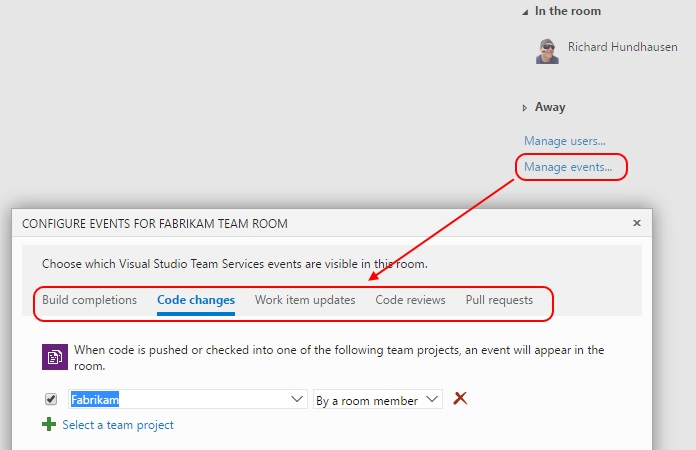
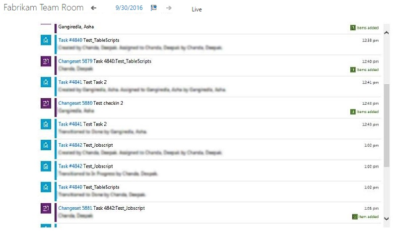
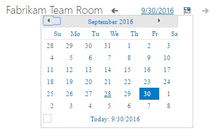

---
title: "Wassup Team Room?"
date: 2016-09-30T13:05:47Z
author: "Richard Hundhausen"
slug: "wassup-team-room"
draft: false
tags: ["Azure DevOps", "TFS", "Visual Studio ALM"]
---

---

According to Microsoft's official definition, Team Rooms, like chat rooms, "provide teams with a space to discuss work in progress, ask questions, share status, and clarify issues that arise." Sounds great, but I find that most teams I train, coach, and consult are using <a href="https://info.seibert-media.net/display/Atlassian/Comparison+of+HipChat,+Slack,+Jabber,+XMPP,+Lync,+Skype+for+Business,+Whatsapp+and+other+group+chat+solutions" target="_blank" rel="noopener">other products</a> for this type of collaboration. Add to that a <a href="https://visualstudio.uservoice.com/search?filter=ideas&amp;query=team%20room" target="_blank" rel="noopener">general feeling</a> that Microsoft isn't innovating within this feature, and I'd pretty much written off team rooms.

That is, until <a href="https://twitter.com/brianrandell?lang=en" target="_blank" rel="noopener">Brian Randell</a> showed me an alternate use case ... Team Rooms can be used to simply let you know what's been going on within a team project without any direct action by the team. Here's how ...

1. Navigate to the room and <a href="https://www.visualstudio.com/da-dk/docs/work/productivity/collaborate-in-a-team-room#add-events" target="_blank" rel="noopener">add events</a> for build completions, code changes, work item updates, etc ...

2. Go on vacation (or otherwise <a href="http://www.merriam-webster.com/dictionary/chillax">chillax</a>), return, and ask the team room wassup ...

3. Click the date at the top and see wassup on previous days as well.

Now if we could only search within a room, that would be awesome. If you agree, please <a href="https://visualstudio.uservoice.com/forums/330519-team-services/suggestions/4540623-seach-in-tfs-team-room" target="_blank" rel="noopener">vote</a>.
