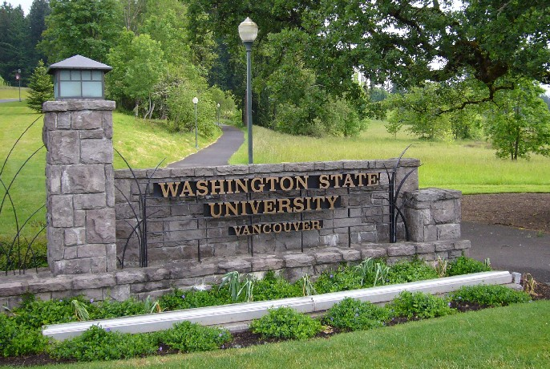
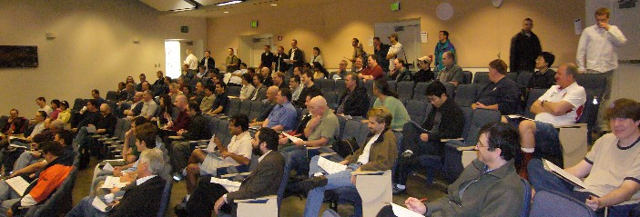

Welcome to Camp! Portland Code Camp 3.0 (as was 2.0) is being&nbsp;hosted at the gorgeous <a href="http://www.vancouver.wsu.edu/" target="none" rel="noopener">WSU Vancouver campus</a>.

 

There are quite a few attendees here. I counted around 90 at this morning's welcome session.

 Click the above to zoom-in

As for my SQL Server 2005 Worst Practices talk, if you'd like to download the slides, code, or sample project, please click <a href="PDX3SQLWorstPractices.zip" target="none" rel="noopener">here</a>.
