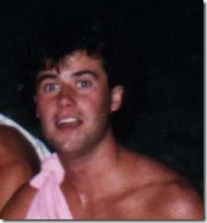
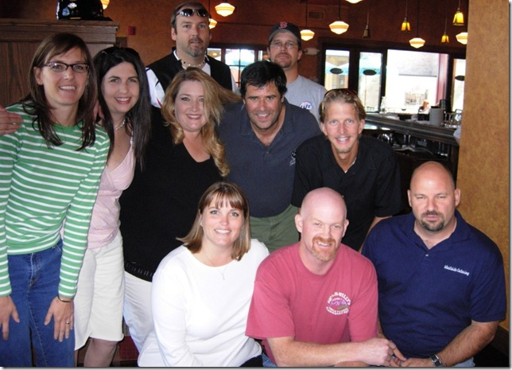

 
 
I lost a friend from High School a few weeks ago - Scott Chestnut (yes that's a Toga). I've known Scott since junior high and spent many a weekend evening with him in high school. We drifted apart since graduation, but saw each other a few times. One such encounter was an impromptu lunch with some other 1986'ers here in Boise in 2006 (Scott's in the center with his trademark "turban" haircut).
 
 
 
Here is his official obituary from the <a href="http://individual.com/story.php?story=93110479" target="_blank" rel="noopener">Times News newspaper</a>.
 
WALNUT CREEK, Calif. -- Scott Thomas Chestnut passed away peacefully and surrounded by the love of his family and friends in the early morning hours of Thursday, Dec. 4, 2008, after a long battle with alcoholism. Scott will be remembered for his sense of humor, intelligence, generosity, and ability to live life in the moment.   
Scott was born in California and grew up in Twin Falls. He graduated from Twin Falls High School in 1986, leaving behind a legacy of many memorable stories. After Twin Falls High School, he graduated from Saddleback Community College and continued his study of physics at Cal Poly San Luis Obispo. Scott lived in Twin Falls, Boise and, most recently, Walnut Creek, Calif., while working as a network engineer.   
He is survived by his fiancee, Amy Gibbons; his parents, David and Jill Chestnut; his siblings, Shannon and Steve Reheuser, Amy and Jeff Dodds, and Todd and Lacie Chestnut; his grandmother, Anna Dugan; his grandfather, Wesley Chestnut; three nephews and one niece; aunts and uncles; cousins; and numerous friends.   
A celebration of Scott's life was held Dec. 6 in Alameda, Calif. A service will be held at 4:30 p.m. Saturday, Dec. 13, at the Ascension Episcopal Church, 371 Eastland Drive N. in Twin Falls.   
In lieu of flowers, please donate to the Scripps Research Institute, Pearson Center for Alcoholism &amp; Addiction Research, www.pearsoncenter.org, (858)784-7268 or a charity of your choice.
