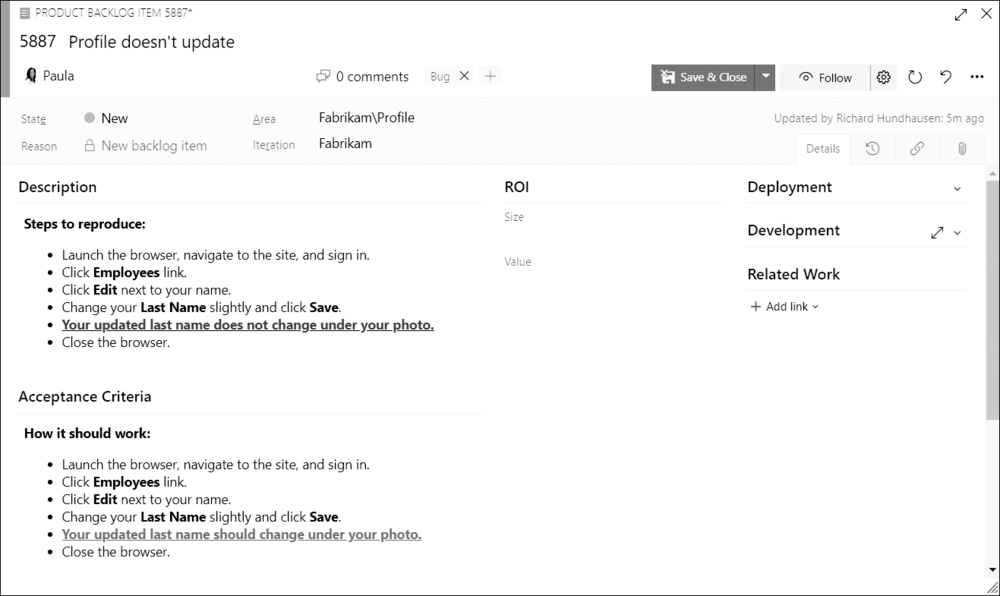

A bug report is exactly what it sounds like: the reporting of a bug or other unwanted behavior in the product. The point of writing a good one is to give the Scrum Team enough information to understand it, gauge its impact, and decide if it's worth fixing. Most bad bug reports fail not because the bug was hard, but because the report was lazy. Here are the fields that actually help Developers reproduce and fix the problem.

<strong>A clear title</strong>

A good, clear title is a must. A team member should grasp the essence of the bug from the title alone, without reading the whole work item. When the backlog is full, a sharp title saves everyone time during refinement, forecasting, and development. So no "Help!", "It's broken", "Got an error", or "Dude!" Those titles are devoid of content at best and irritating at worst. Keep titles short and concise, and save the explanation for the other fields.

<strong>Observed vs. expected results</strong>

This is the part most reports skip, and it's the most valuable. A bug report should always contain the observed results as well as the expected results.

<figure class="wp-block-image size-large has-custom-border"></figure>

The reason is human. Sometimes Developers don't think a bug is really a bug, or they claim "it works on my machine" without knowing what "works" even means. Sometimes the opposite is true and the expected result works for them but the production deployment differs. The variance between expected and observed is what proves the case. Generic lines like "This is a bug" or "It should work" help no one. Describe the observed results, including the steps to reproduce, in the Description. Track the expected results in the Acceptance Criteria field, which doubles as a head start on better tests.

<strong>Repro steps</strong>

List repeatable steps to reproduce the bug. You've experienced firsthand that if you don't write the exact steps down, you forget them fast. Be as specific as necessary without being wasteful, and report only one bug per work item so nothing gets overlooked. A picture helps too; an annotated screenshot often shows in seconds what a paragraph can't.

<strong>Environment</strong>

Specify the system information, including the build or version number that produced the failure. A precise build number points the team at the exact problematic build. Without it, they might chase a problem already fixed in a newer build, or hunt for one in code that hadn't been integrated yet.

One last thing: be professional. Proofread before you save, skip the politics, and remember your teammates can't read minds. A clear, respectful, well-specified bug report has a far higher chance of being understood and fixed. Sounds like good Scrum to me.

