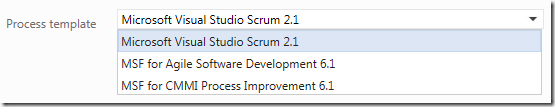
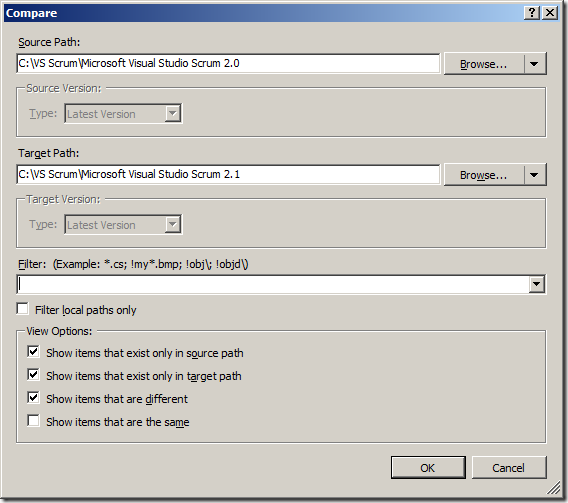
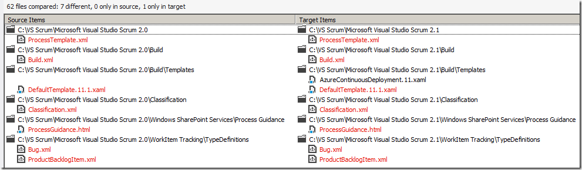

---
title: "What’s new in the Visual Studio Scrum 2.1 Process Template?"
date: 2012-11-28T16:01:22Z
authors: ["Richard Hundhausen"]
slug: "whats-new-in-the-visual-studio-scrum-2-1-process-template"
draft: false
tags: ["Azure DevOps", "Scrum", "TFS"]
---

---

If you’ve connected to the hosted Team Foundation Service lately, you’ve noticed a new version of the Scrum template is available …
 

 
Being the curious type, I connected to the service with Visual Studio 2012, downloaded the new template, and compared it with the 2.0 process template using the Compare tool in Visual Studio …
 

 
It seems that there are 7 files that have changed, and 1 new one in the 2.1 template …
 

   
Other than the obvious changes to metadata (2.0 &gt; 2.1, etc.), it appears the new version only has a few substantive changes …
 <ul> <li>A new custom build process template to support <a href="http://blogs.msdn.com/b/bharry/archive/2012/06/07/announcing-continuous-deployment-to-azure-with-team-foundation-service.aspx" target="_blank" rel="noopener">Continuous Deployment to Azure</a></li> <li>In the default build template, the Sources, Binaries, and TestResults directory names have been shortened from Sources to src, Binaries to bin, TestResults to tst</li> <li>Bug and PBI work item types can now be transitioned from Approved &gt; New, Committed &gt; New, Done &gt; New, Done &gt; Approved, and Approved &gt; Done.</li></ul>
