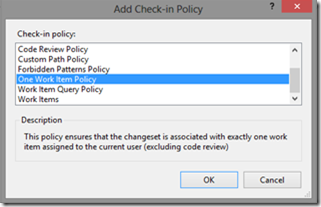

---
title: "What's New in the Visual Studio Scrum 2013.2 Process Template"
date: 2014-03-24T14:47:10Z
authors: ["Richard Hundhausen"]
slug: "whats-new-in-the-visual-studio-scrum-2013-2-process-template"
draft: false
tags: ["Scrum", "TFS"]
---

---

I noticed today that the process templates in Visual Studio Online are showing a “.2” suffix in their names. I’m not exactly sure when this update occurred, but am pretty sure it’s related to Visual Studio 2013 <a href="http://support.microsoft.com/kb/2927432" target="_blank" rel="noopener">Update 2</a>, which is imminent.
 

 
So, I launched Visual Studio 2013, opened Team Explorer, and downloaded the Microsoft Visual Studio Scrum 2013.2 process template. I extracted it right next to the prior (RTM) version.
 

 
I then dropped to the Visual Studio 2013 command prompt and executed the following:
 
<strong>tf folderdiff "c:microsoft visual studio scrum 2013" "c:microsoft visual studio scrum 2013.2" /recursive</strong>
 
This launches the Folder Difference tool, where we can see that there are only a few differences between the versions:
 

 
Other than the obvious metadata (name and version) differences, I only saw a few differences:
 <ul> <li>Support for the new Shared Parameter work item type, category, and link type (“references” and “referenced-by”)</li> <li>The ProductBacklog.wiq and SprintBacklog.wiq queries have been removed</li></ul> 
In summary, it seems that most of the updates are pertaining to the new support for Shared Parameters, which will enable testers the ability to manage test parameter data centrally. Any subsequent changes to parameter data can be updated at one place and all the test cases referencing the Shared Parameter are automatically updated.

