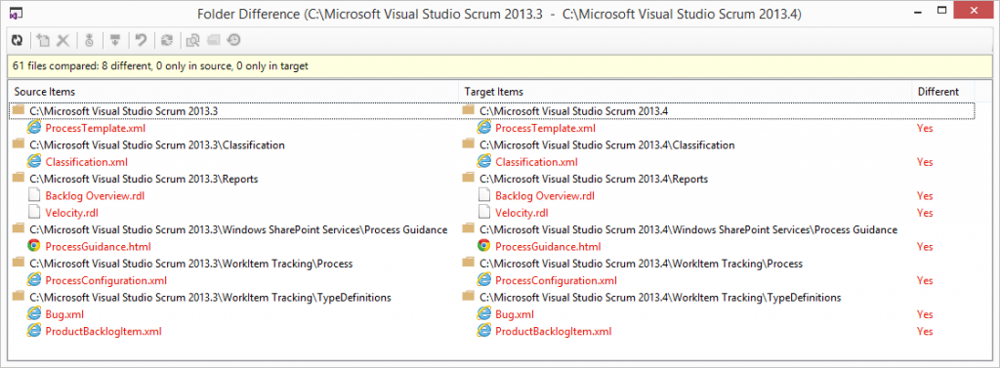
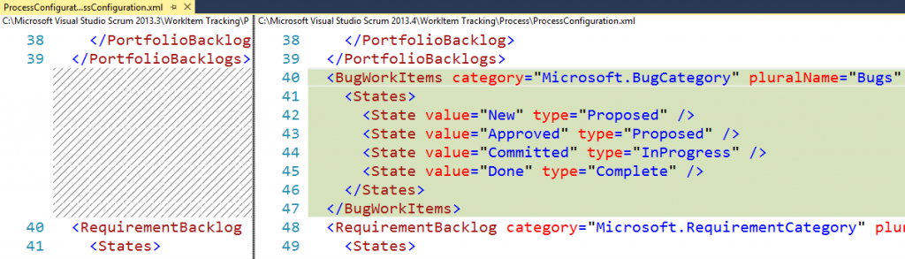
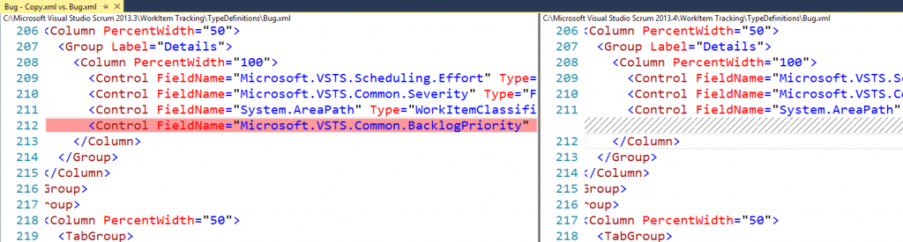

---
title: "What’s New in the Visual Studio Scrum 2013.4 Process Template"
date: 2014-11-14T07:28:20Z
authors: ["Richard Hundhausen"]
slug: "whats-new-in-the-visual-studio-scrum-2013-4-process-template"
draft: false
tags: ["Scrum", "TFS", "Azure Boards", "Azure Test Plans", "SQL Server", "Testing"]
---

---

Many Visual Studio and .NET <a href="http://blogs.msdn.com/b/somasegar/archive/2014/11/12/opening-up-visual-studio-and-net-to-every-developer-any-application-net-server-core-open-source-and-cross-platform-visual-studio-community-2013-and-preview-of-visual-studio-2015-and-net-2015.aspx" target="_blank" rel="noopener">announcements</a> were made this week. A minor one was the RTM of Visual Studio 2013 <a href="http://support.microsoft.com/kb/2994375" target="_blank" rel="noopener">Update 4</a>. This update included improvements and bug fixes to Team Foundation Server 2013.

To satisfy my curiosity, as I've <a href="https://accentient.com/blog/whats-new-in-the-visual-studio-scrum-2013-2-process-template/" target="_blank" rel="noopener">done in the past</a>, I wanted to see what's new in my favorite process template, so I downloaded the 2013.3 and 2013.4 versions and compared them using the tf folderdiff command ...

<strong>tf folderdiff "Microsoft Visual Studio Scrum 2013.3" "Microsoft Visual Studio Scrum 2013.4" /recursive
</strong>

This launches the Folder Difference tool, where we can see that there are only a few differences between the versions:

Other than the obvious metadata (name and version) differences, I only saw a few differences:
<ul>
	<li>SQL Query updates (mostly changing identifier case) in the Backlog Overview and Velocity reports</li>
	<li>A new BugWorkItems section in ProcessConfiguration.xml - probably to support the new bugs on the backlog capability (for the other process templates)

</li>
</ul>
<ul>
	<li>Removed Backlog Priority from the Details section for both Product Backlog Item and Bug work item types

</li>
</ul>
<ul>
	<li>In the ProcessConfiguration.xml file, Test Plans, Test Suites, and Shared Parameters now have defined colors.

</li>
</ul>
In summary, it seems that this was a pretty small update, with only minor changes.
