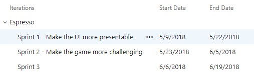
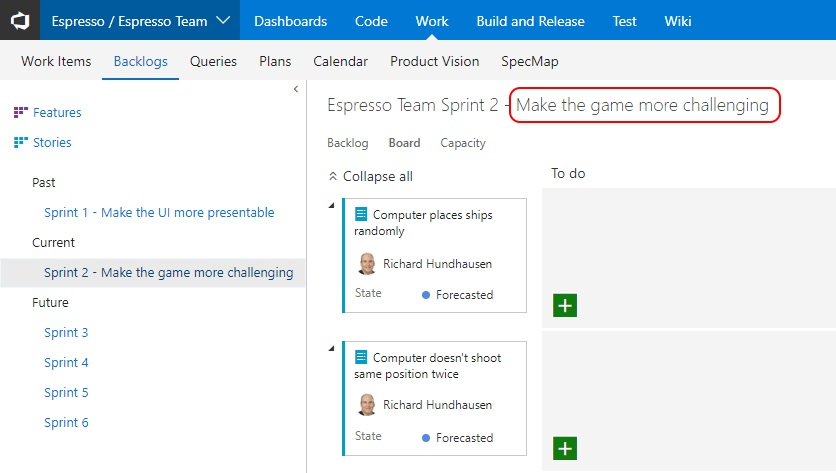

---
title: "What's our Sprint Goal?"
date: 2018-05-23T07:41:51Z
author: "Richard Hundhausen"
slug: "whats-our-sprint-goal"
draft: false
tags: ["Azure DevOps", "Scrum", "TFS"]
---

---

According to the <a href="https://www.scrumguides.org/scrum-guide.html" target="_blank" rel="noopener">Scrum Guide</a>, the Sprint Goal is an objective set for the Sprint that can be met through the implementation of Product Backlog. It provides guidance to the Development Team on why it is building the Increment. As the Development Team works, it keeps the Sprint Goal in mind. Unfortunately, there is no first class support for Sprint Goals in VSTS. Instead, a team could write it on their whiteboard, use the VSTS Wiki, or add something to a dashboard (in fact there is a <a href="https://marketplace.visualstudio.com/items?itemName=keesschollaart.sprint-goal" target="_blank" rel="noopener">widget extension</a> in the marketplace for doing the latter). While these are all working solutions, they don't necessarily keep the Sprint Goal "in the team's face" while they plan and execute their work in the Sprint Backlog.

This simple trick, suggested by <a href="https://twitter.com/aleksejdix" target="_blank" rel="noopener">Aleksej Dix</a> in my Professional Scrum Developer class this week fits that bill - simply include the Sprint Goal in the Sprint name ...

Then the Sprint Goal is big and visible as the team interacts with the Sprint Backlog and task board ...
#Simple #FitForPurpose
