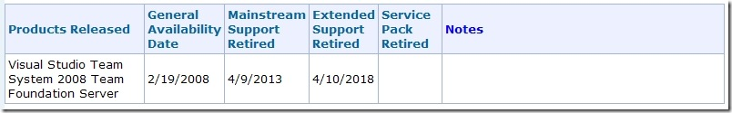

I happened upon this interesting Microsoft site the other day. You can lookup the end-date for mainstream as well as extended support for your favorite (Microsoft) software product, such as Team Foundation Server 2008:
 
 
 
You can lookup by <a href="http://support.microsoft.com/gp/lifeselectindex" target="_blank" rel="noopener">index</a>, <a href="http://support.microsoft.com/gp/lifeselect" target="_blank" rel="noopener">product family</a>, or by <a href="http://support.microsoft.com/lifecycle/search/" target="_blank" rel="noopener">searching</a>.
 
You can read more about Microsoft Support Lifecycle <a href="http://support.microsoft.com/lifecycle" target="_blank" rel="noopener">here</a>. Be sure to checkout the list of <a href="http://support.microsoft.com/gp/lifeobsoleteproducts" target="_blank" rel="noopener">obsolete products</a> too (like Microsoft FoxBASE).
