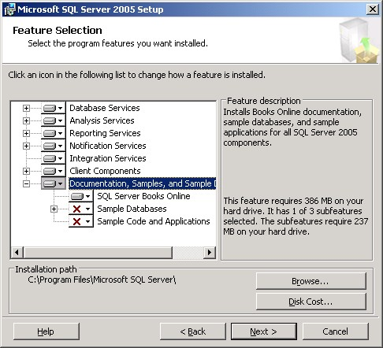

I was asked this again last week, so it's time to blog!

When installing SQL Server 2005, you need to click the Advanced button to get to the screen below so that you can include the sample databases and project code. If you just check the boxes for the various database services, these <strong>won't</strong> get installed by default.
 