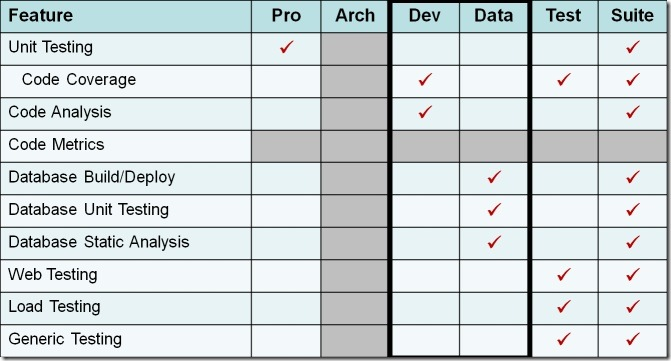

I finally took the time to put together a chart showing which edition of Visual Studio needs to be installed on the Team Build server to achieve specific features. As you can see, Team Suite has you covered. As for the question of whether or not you need to <em>purchase </em>an additional copy of Visual Studio for this - that question has been answered on <a href="http://blogs.msdn.com/jeffbe/archive/2008/03/18/licensing-team-system-editions-for-your-build-machine.aspx" target="_blank" rel="noopener noreferrer">Jeff Beehler's blog</a> as well as in the <a href="http://www.microsoft.com/downloads/details.aspx?familyid=CE194742-A6E8-4126-AA30-5C4E969AF2A3&amp;displaylang=en" target="_blank" rel="noopener noreferrer">VSTS 2008 Licensing White Paper</a>.

I might also add that <a href="http://mcwtech.com/cs/blogs/brianr" target="_blank" rel="noopener noreferrer">Brian Randall</a> mentioned that you can automate the validation of Architect Edition Deployment Diagrams on the Team Build server if you install that edition; but, being that he's the only guy on the planet to probably do that, I didn't think it was worth mentioning.