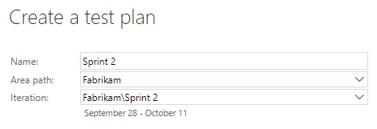
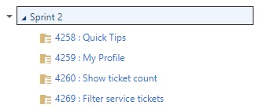
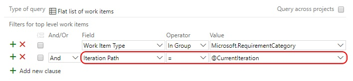
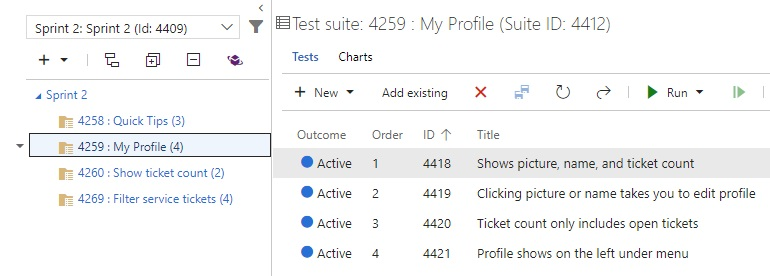
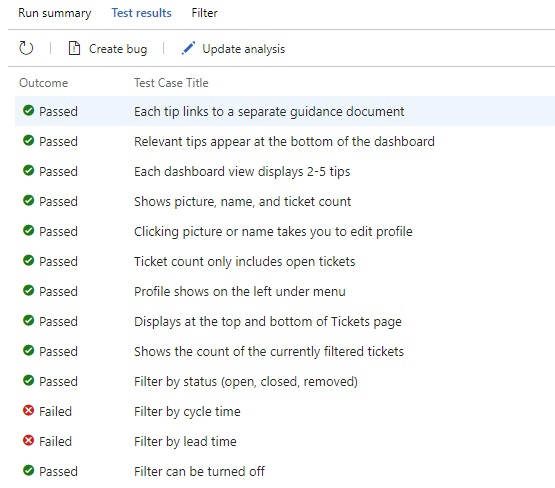
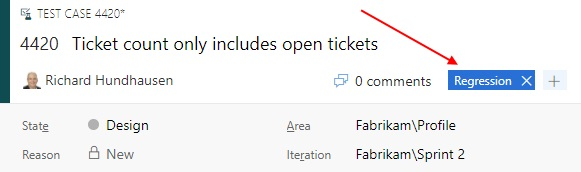
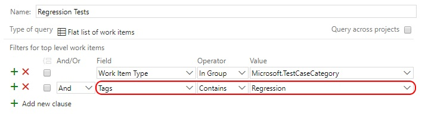
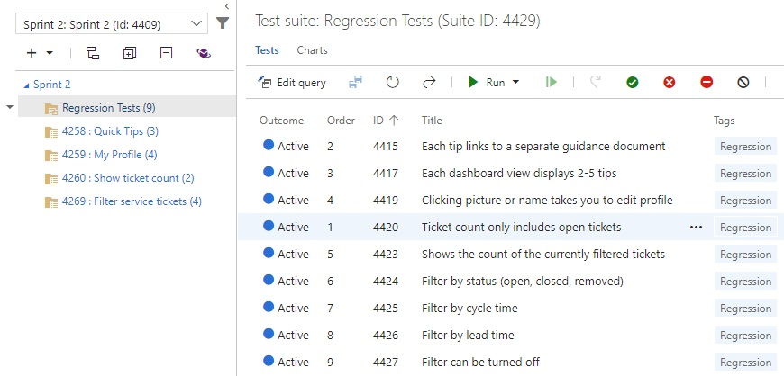

---
title: "Which tests are my regression tests?"
date: 2017-09-28T20:16:49Z
author: "Richard Hundhausen"
slug: "which-tests-are-my-regression-tests"
draft: false
tags: ["Azure DevOps", "Scrum", "TFS"]
---

---

Although we can't help you decide <em>which</em> tests should be part of your regression suite, we can help you easily identify them by using tags.

Over the years, we've seen teams using Team Foundation Server and Visual Studio Team Services to create a separate static test suite or even a test plan. Those approaches are way too much work. Let's look at a much easier approach.

First, we'll create a simple test plan for Sprint 2 ...

Next, we'll create a requirement-based suite for each PBI in our Sprint 2 backlog ...

BTW, to get the above list of requirements, just change the criteria to the following ...

Next, we'll create test cases for each PBI (preferably associated to automated tests) ...
Tip: A good rule of thumb is to create at least one test case per acceptance criterion, which is exactly what Anna Russo's auto-create test tool does. Now if only it were a VSTS extension, integrated into the Test hub!

Let's assume that Sprint 2 is winding down, and your tests show that you'll probably be done in time for tomorrow's Sprint Review ...

One of the last things in our team's definition of "done" is to identify those test cases which should be added to their regression suite. These are the test cases that the team decides should be run in future sprints to ensure that new work does not cause unintended effects in previously working software. Test cases that cover brittle areas, high technical debt areas, and areas of core/critical functionality are good candidates for regression testing.

Once we've logically identified those test cases, just edit each one (they are just work items) and add a <em>Regression</em> tag ...

Finally, just create a query-based suite showing all test cases with the <em>Regression</em> tag ...

Voilà, a suite that always shows an updated list of those test cases marked for regression. All we have to do is add or remove tags from those test cases that we want to add or remove from the regression suite ...

Tip: You may want to adopt a test case naming convention that prefixes the test case name with the PBI name or abbreviation.

&nbsp;
