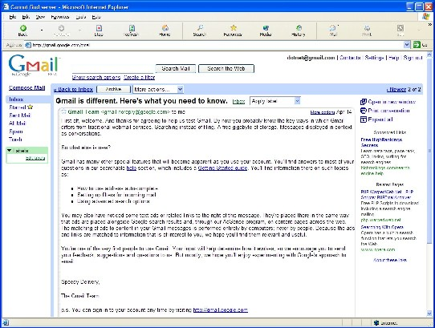

As a&nbsp;Gmail user, I still can't see what the commotion is all about. If you don't like it, don't use it. Simple. Here's a good rant by Tim O'Reilly on the subject.

<a href="http://www.oreillynet.com/pub/wlg/4707" target="none" rel="noopener">The Fuss About Gmail and Privacy: Nine Reasons Why It's Bogus</a>

Screenshot of Gmail with email from including the targeted advertisement

