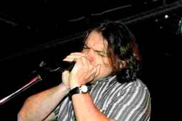
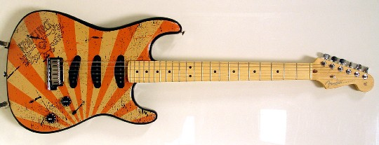

At Tech-Ed in Boston, we ran our first Regional Director Talent Show. <a href="http://geekswithblogs.net/jalexander/" target="none" rel="noopener">John Alexander</a> was courageous enough to warm up the crowd with a series of impressions. He did impressions of famous people such as US Presidents, film stars and…well, other Regional Directors! It was hilarious. Next, <a href="http://geekswithblogs.net/kenspencer/" target="none" rel="noopener">Ken Spencer</a> sang and played guitar for the crowd. He performed his version of Margaretaville while everyone cheered and clapped to the beat. Next was <a href="http://www.intellectualhedonism.com/" target="none" rel="noopener">Carl Franklin</a> who started by impersonating Bruce Springsteen and then performed a spirited acoustical guitar instrumental. <a href="http://www.dasblonde.net/" target="none" rel="noopener">Michele Leroux Bustamante</a> also played guitar and sang her amusing and unforgettable rendition of Smelly Cat which originates from a performance by Phoebe on the TV Show Friends. Each of these RDs did a phenomenal job and the judging was very close.

The winner was one of our new RDs, <a href="http://weconlog.spaces.msn.com/PersonalSpace.aspx" target="none" rel="noopener">Alexander Wechsler</a> from Germany. He sang his version of the Rolling Stone’s hit Honky-Tonk Women, breaking out in a harmonica solo to cinch the deal. He brought the house down.

 He may be a new RD, but everyone knows his name now. He is the winner of the custom painted Fender Stratocaster guitar. Special thanks to <a href="http://www.timheuer.com/blog/" target="none" rel="noopener">Tim Heuer</a> for donating the Fender Stratocaster guitar. He helped make this fun event possible. Thanks Tim!
