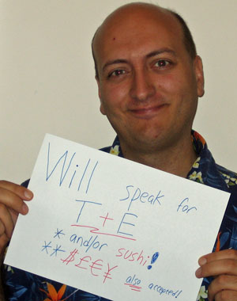

I met <a href="http://www.hower.org/Chad/index.aspx" target="none" rel="noopener">Chad Z. Hower</a>&nbsp;at Tech-Ed 2006 in Malaysia a few weeks ago, and was very impressed with his knowledge and presentation skills. Mostly, I was impressed&nbsp;with his extensive travel (makes me seem aerophobic), living overseas, and jaw-dropping stories. I just learned that Chad has gone independent, leaving Microsoft recently. If you are looking for an energetic presenter on all topics Microsoft-developer related, check out his professional&nbsp;<a href="http://www.woo-hoo.net/" target="none" rel="noopener">site</a>&nbsp;and his fun <a href="http://www.kudzuworld.com" target="none" rel="noopener">site</a>.

Woo Hoo!!!
