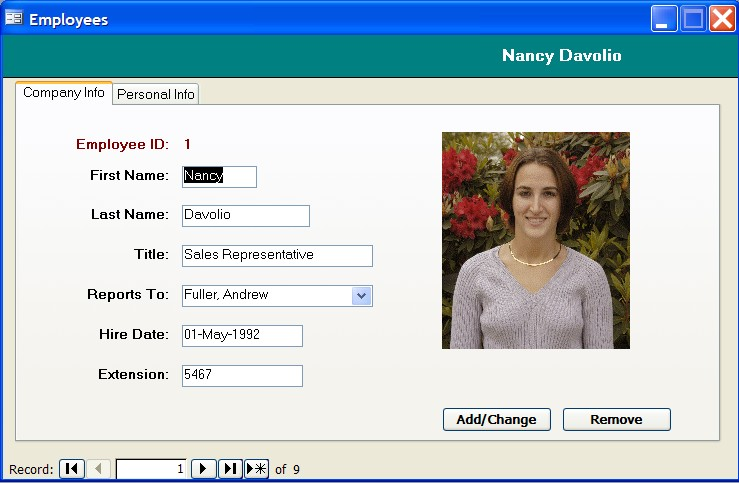

I can always spot the true geeks at the user group meetings and conferences, because not only do they know who Nancy Davolio is, they've seen her photo. My <a href="http://www.ineta.org" target="none" rel="noopener">INETA</a> presentation earlier this week for the <a href="http://www.setfocus.com/n3ug/welcome.aspx" target="none" rel="noopener">Northern New Jersey .NET User Group</a> at <a href="http://www.setfocus.com/" target="none" rel="noopener">SetFocus</a> in New Jersey include such wise souls as Al Smith, and together we explored the subject.

It seems that "Nancy's" photo changes with each&nbsp;version of Access (2003 version) ...

 The Nancy that I grew up knowing    Nancy 2003

Who will we see in Office 2007? :-)

Turns out this mystery has been <a href="http://www.ammara.com/nancy_davolio.html" target="none" rel="noopener">blogged</a> about before.
