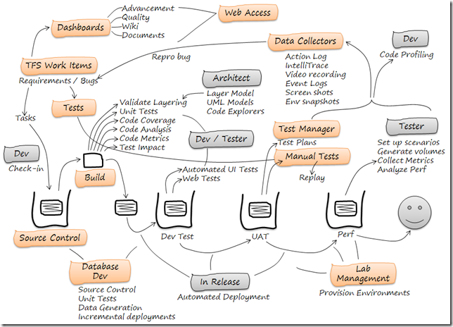
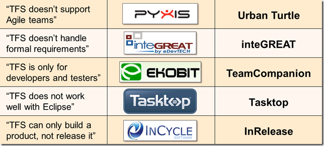
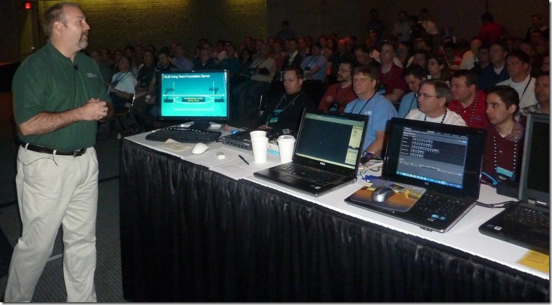

---
title: "Would You, Could You With TFS?"
date: 2011-05-27T23:00:39Z
authors: ["Richard Hundhausen"]
slug: "would-you-could-you-with-tfs"
draft: false
tags: ["Conferences", "Microsoft", "TFS"]
---

---

As you know Team Foundation Server 2010 supports most (but not all) Application Lifecycle Management (ALM) activities as the busy diagram below (from <a href="http://www.incyclesoftware.com" target="_blank" rel="noopener">InCycle Software</a>) suggests:
 

 
In addition to identifying the <em>few</em> gaps in ALM support (and ways to plug them), there are a couple of other myths that we busted last week at TechEd during my interactive presentation titled "Would You, Could You with TFS":
 

 
It was a fun presentation with introductions and demonstrations of five wonderful <a href="http://msdn.microsoft.com/en-us/vstudio/dd637761" target="_blank" rel="noopener">Visual Studio Industry Partners (VSIP)</a> products that extend Visual Studio Team Foundation Server 2010.
 

 
Files: <a href="DEV271-INT.pptx" target="_blank" rel="noopener">Presentation (5mb)</a>

